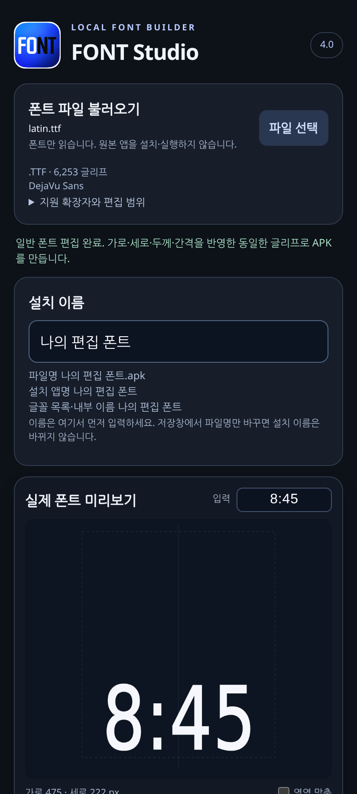

# FONT Studio 4.0

폰트의 가로·세로·두께·글자 간격을 조절하고, 원하는 설치 이름으로 폰트 APK를 만드는 Android 앱입니다. 이 저장소에는 제작 대화의 **최종 4.0 산출물만** 보관합니다.

## 다운로드

- [앱 설치 파일 — FONT_Studio_v4.apk](FONT_Studio_v4.apk)
- [소스 코드·상세 사용 안내·검사 기록 ZIP](FONT_Studio_v4_Source_and_Checks.zip)
- [파일 무결성 확인용 SHA-256](SHA256SUMS.txt)

GitHub 파일 화면에서 **Download raw file** 버튼으로 내려받으세요. Android 8.0(API 26) 이상을 대상으로 하며, 실제 기기 호환성은 아래 제한을 확인해 주세요.

## 빠른 사용법

1. APK를 휴대폰에 내려받아 설치하고 **FONT Studio 4**를 실행합니다. 기존 3.0과 별도 앱으로 설치됩니다.
2. **파일 선택**으로 원본 폰트를 불러옵니다. 복수 글꼴 파일이면 사용할 글꼴 하나를 선택합니다.
3. 앱 안에서 **설치 이름**을 입력합니다. 한글과 공백을 사용할 수 있습니다.
4. 가로·세로·두께·간격을 조절하고 미리보기를 확인합니다. 일반 폰트의 두께는 **0이 원본, 음수는 얇게, 양수는 두껍게**입니다. 작은 값부터 조절하세요.
5. **이 이름으로 APK 생성**을 눌러 저장한 뒤, 생성된 폰트 APK를 설치합니다.
6. 기기의 잠금화면 추가 글꼴 메뉴에서 표시·적용 여부를 확인합니다. 설치 성공이 글꼴 적용 성공을 보장하지는 않습니다.

## 앱 미리보기

원래 제작 대화에서 제공된 4.0 화면입니다. 실기기 검증 화면은 아닙니다.

## 지원 형식

| 입력 | 처리 |
|---|---|
| `.ttf`, `.otf` | 일반 윤곽선 폰트를 불러와 편집 |
| `.ttc`, `.otc` | 포함된 글꼴 하나를 선택하여 편집 |
| `.apk` | 내부 폰트를 선택하여 편집. 원본 앱은 실행하지 않음 |

`.woff`·`.woff2`, 색상·비트맵 글꼴 및 일부 특수 가변 폰트는 지원하지 않습니다. 가변 폰트는 자체 굵기 축을 사용합니다. **앞자리 0은 OPPO 시계 모드 전용 실험 옵션**이며 일반 폰트에서는 비활성화됩니다.

## 이름·업데이트·제한

- 설치 이름은 APK를 만들기 **전에 앱 안에서** 정합니다. 마지막 저장창에서 파일명만 바꾸면 내부 이름은 바뀌지 않습니다.
- 4.0 안에서 같은 이름으로 만들면 같은 패키지와 저장된 서명키를 재사용합니다. 키를 유지하려면 앱 데이터를 삭제하지 마세요. 키 백업·복원은 지원하지 않습니다.
- 실제 Android 설치·실행 및 삼성 S25 Edge 잠금화면 적용은 원래 제작 기록에서도 미검증 상태입니다. 날짜 글꼴의 적용을 강제하지 않습니다.
- 공식 `apksigner` 및 실기기 검증은 수행되지 않았습니다. APK 서명과 Play Protect·삼성 설치 정책은 별개이며, 경고 없는 설치를 보장하지 않습니다.
- 가져오는 폰트의 사용·수정 조건을 확인하세요. ZIP의 `THIRD_PARTY_LICENSES.txt`에 포함 라이브러리의 라이선스가 있습니다.

## 소스와 검증 기록

ZIP을 풀면 `FONT_Studio_v4/README_KO.md`에 상세 사용법과 재빌드 안내, `tests/RUNNING.md`에 검사 실행 안내, `checks/`에 원래 제작 당시 검사 기록이 있습니다. 당시 기능 검사 결과를 이번 업로드에서 새로 수행한 결과로 간주하지 않습니다.

업로드 준비 과정에서 APK의 크기와 SHA-256이 ZIP에 포함된 최종 검사 기록과 일치함을 확인했습니다. 원본 APK·ZIP·프리뷰 이미지는 변경하지 않았습니다.
